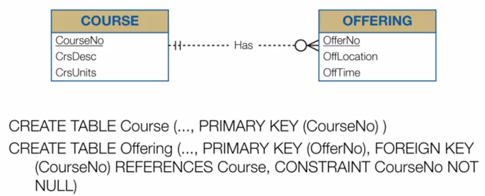
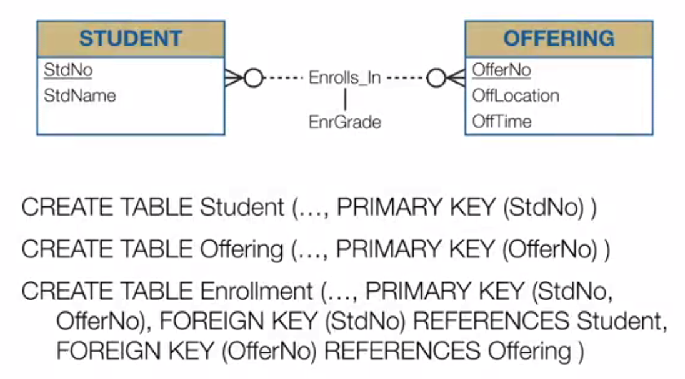
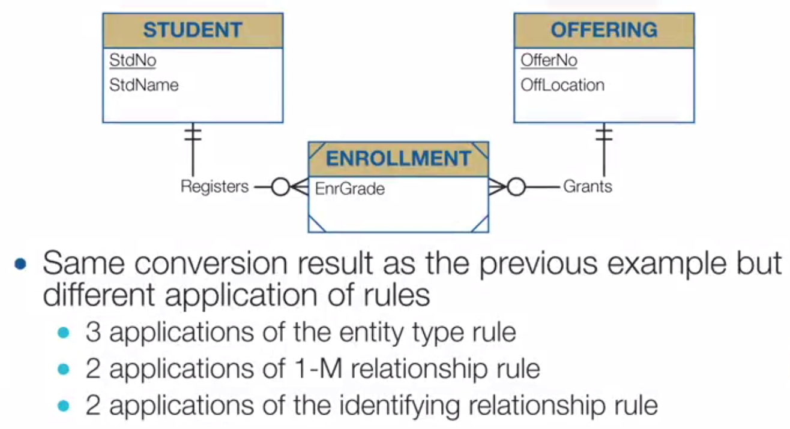
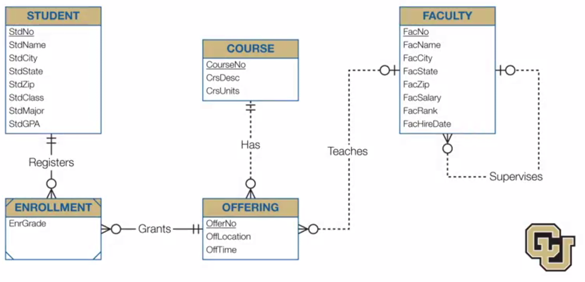
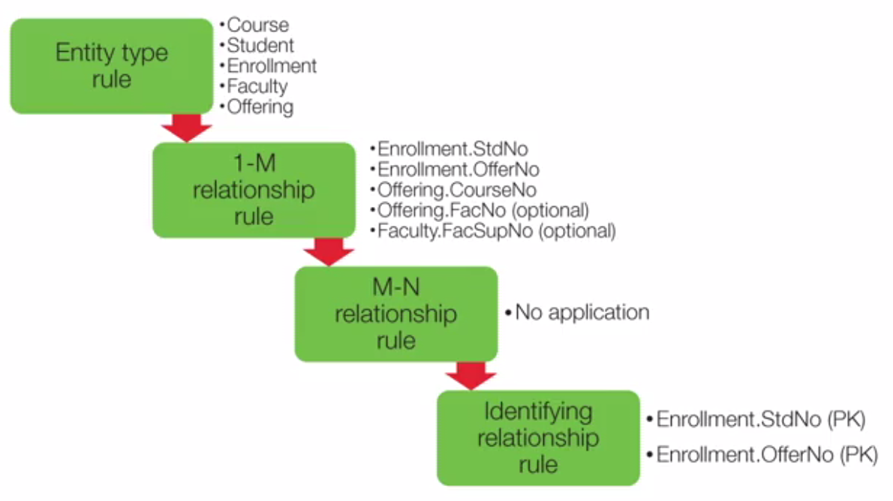
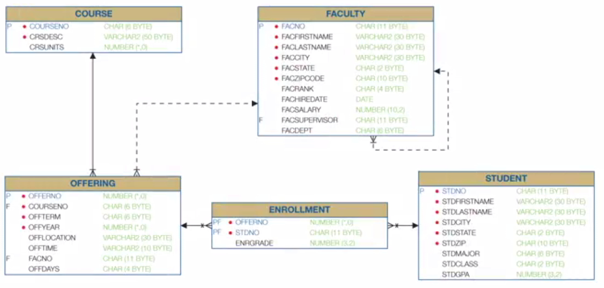

## Week 6 - Schema Conversion

### Goals and Steps of Logical Database Design

##### Managing Redundancy
Is the main theme of the logical DB design.

- Identify possible redundancy
- Eliminate unwanted redundancy
- Support organizational policies
- Update orientation

##### Logical Database Design Phases

- Convert: ERD to initial table design
- Specify: Redundancy constraints
- Normalize: Eliminate unwanted redundancies
- Refine: Unqiueness constraints, other constraints


### Conversion Rules

##### Entity Type Rule: Entity type => Table
- PK of entity type => PK of table (unless weak)
- Attributes of entity type => Columns in table

##### 1-M Relationship Rule: Relationship => FK
- FK should be placed in a child table

##### M-M Relationship Rule: Relationship => Combined PK
- Attributes in M-M relationship => Columns in table

##### Identification Dependency Rule
- Add components to PK of table

##### Exercise








### Conversion Problems





```sql
CREATE TABLE Course
(
   ...,
   PRIMARY KEY (CourseNo)
)

CREATE TABLE Student
(
    ...,
    PRIMARY KEY (StdNo)
)

CREATE TABLE Faculty
(
    ...,
    PRIMARY KEY (FacNo),
    FOREIGN KEY (FacSupNo) REFERENCES Faculty
)

CREATE TABLE Offering
(
    ...,
    PRIMARY KEY (OffNo),
    FOREIGN KEY (CourseNo) REFERENCES Course,
    FOREIGN KEY (FacNo) REFERENCES Faculty,
    CONSTRAINT CourseNo NOT NULL
)

CREATE TABLE Enrollment
(
    ...,
    PRIMARY KEY (OfferNo, StdNo),
    FOREIGN KEY (OfferNo) REFERENCES Offering,
    FOREIGN KEY (StdNo) REFERENCES Student
)
```


