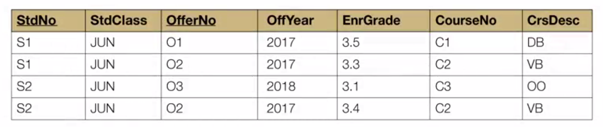

## Week 7 - Normalization Concepts and Practice

### Modification Anomalies
Eliminate unwanted redundancy in a table design

> Good DB design ensures that users can change rows without unexpected side effects.

##### Modification Anomaly
- Unexpected side effects from a row operation
- Insert, modify, and delete more data than desired
- Caused by excessive redundancies

해결하기 위해서
- Strive for "one fact in one place"

##### Big University DB Table: Example of Poorly Designed DB
A single table with a PK as a combination of student number and offer number

- Insertion anomaly: To insert a course (C4), must know student and offering (PK니까)
- Update anomaly: C2 course의 description을 변경하기 위해서는 여러 row를 업데이트헤야 함
- Deletion anomaly: 한 줄에 student, offering, course 정보가 모두 있어서 한 줄을 지우면 다 날라감

##### A Big Table vs. Small Tables
- Query 작성하기엔 big table이 편함 (JOIN small tables == a big table)
- Big table은 modification anomaly 때문에 transaction processing하기가 더욱 어려움
