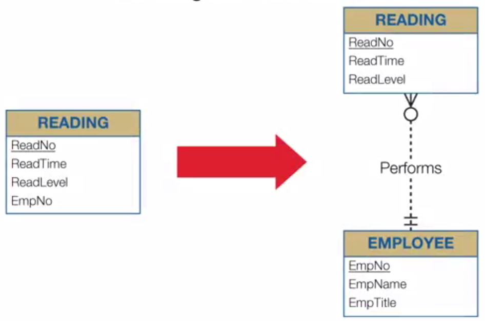
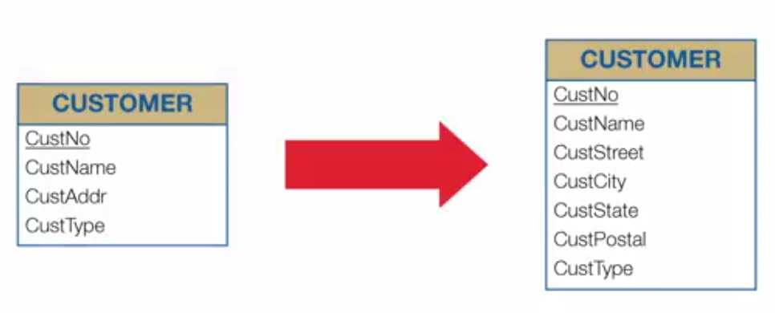
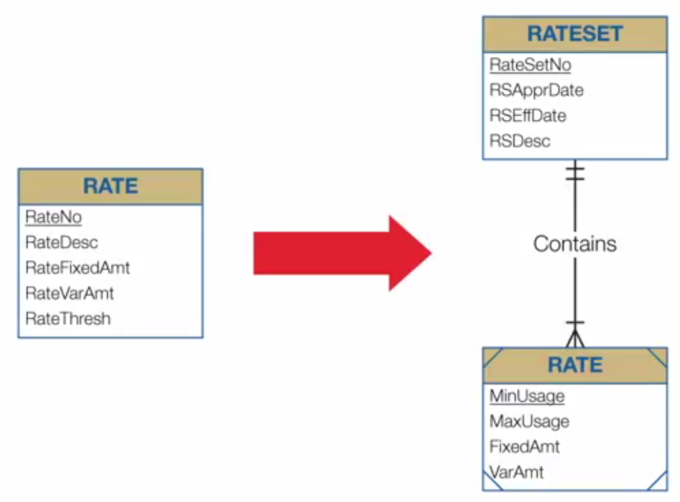
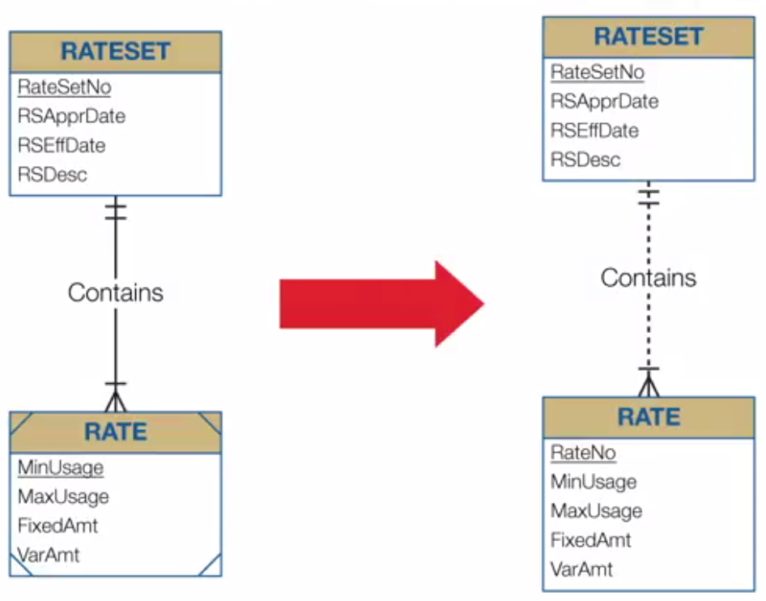
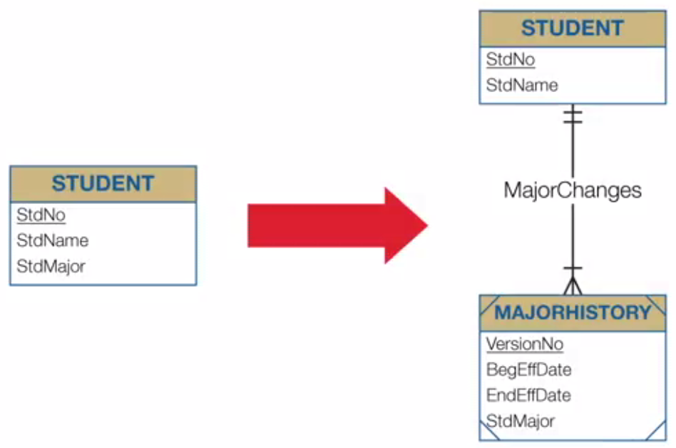

## Week 5 - Developing Business Data Models

### Conceptual Data Modeling Goals and Challenges

##### Broad Goals (Revisited)

To create a DB that provides an important resource for an organization
- Develop a common vocabulary
- Define business rules
- Ensure data quality
- Provide efficient implementation

##### Developing a Common Vocabulary

Good DBA는 good politician과 같다.
- Diverse groups of users
- Difficult to obtain acceptance of a common vocabulary
- Compromise to find least objectionable solution
- Unify organization by establishing a common vocabulary

##### Define Business Rules

- Support organizational policies
- Determine restrictiveness: 적당히를 찾아야 한다.
  - Too restrictive: reject valid business interactions
  - Too loose: allow erroneous business interactions
- Provide exceptions for flexibility

##### Large Database Design Efforts

- Typically involve a team of designers
- Requirements from a diverse group of stakeholders
- Divide and conquer strategy to manage flexibility

##### Ill Defined Problem

Business requirements are rarely well designed.
- Conflicting requirements
- Incomplete requirements
- Diverse stakeholders and formats
- Irrelevent details

Business requirements are typically unstructured with missions, inconsistencies in irrelevent details.

### Analyzing Narrative Problems

##### Goals of Narrative Problem Analysis
- Consistency with narratives
- Identify deficiencies
- Prefer simpler designs

##### Steps
1. Identify entity types and attributes
  - Important nouns
  - Details about nouns
  - Preference for a simpler design
2. Determine PKs (for entity type identification)
  - Stable: "PK should never change"
  - Single purpose: 목적은 오직 identification을 위해서만 (e.g. DB generating numbers)
3. Connect entity types
  - Entity types to connect
  - Minimum and maximum cardinalities
  - Preference for a simpler design

### Design Transformations I

##### Attribute Expansion

##### Compound Attribute Split

##### Entity Type Expansion

##### Weak Entity Type to Strong Entity Type

### Design Transformation II

##### Diagram Refinements

Iterative design process
- Evaluate alternatives
- Use transformations to generate feasible alternatives
- Gather additional requirements if necessary (from users)

##### Attribute History Transformation

##### Reverse Transformations

지금까지 배운 변환을 반대로 하면 됨. 즉 복잡한 것을 더 단순하게 만드는 작업이다.
- Contract entity type <=> Attribute expansion
- Combine attributes <=> compound attribute split
- Contract entity type structure <=> Entity type expansion
- Strong entity type to weak entity type <=> Weak entity type to strong entity type
- Remove history <=> Attribute history transformation
