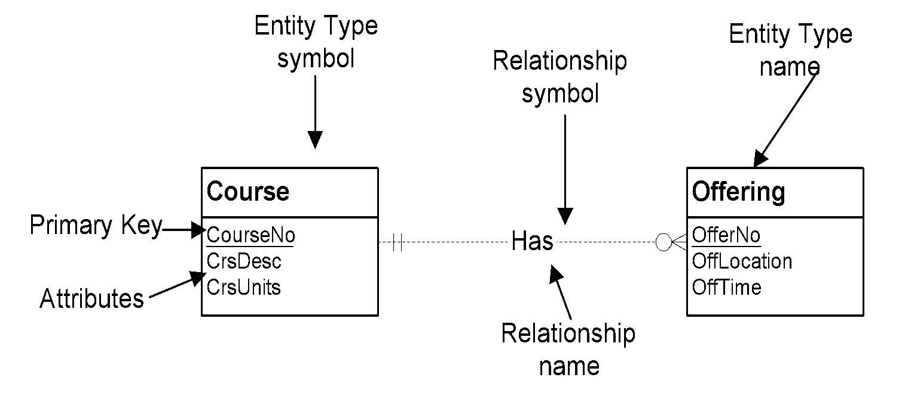
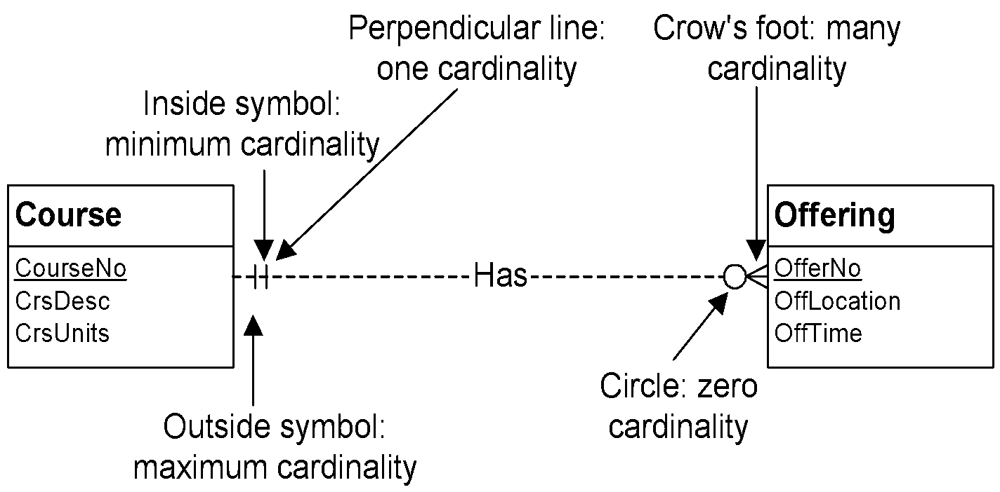

## Week 4 - Notation for Entity Relationship Diagrams

### Database Development Goals

##### Broad Goals of Database Development
- Develop a common vocabulary
- Define business rules
- Ensure data quality
- Provide efficient implementation

##### Database Development Phases
```
- Data Requirements
              - Conceptual Data Modeling
              | ERD
              - Logical Database Design
              | Tables
              - Distributed Database Design
              | Distributed Schema
              - Physical Database Design
                                      - Internal Schema, Populated DB
```


### Basic ERD Notation



##### Basic Elements
- Entity types: collections of physical things, e.g., books, people, payments
- Relationships: named associations among entity types
- Attributes: properties of entity types or relationships

##### Cardinalities
constrain the number of objects that participate in a relationship



##### Important Cardinalities
- Mandatory: Min-card >= 1
- Optional: Min-card = 0
- Functional or Single-valued: Min-card = 1
- 1-M: Max-card = 1 in one direction, Max-card > 1 in the other direction
- M-N: Max-card > 1 in both direction
- 1-1: Max-card = 1 in both direction
