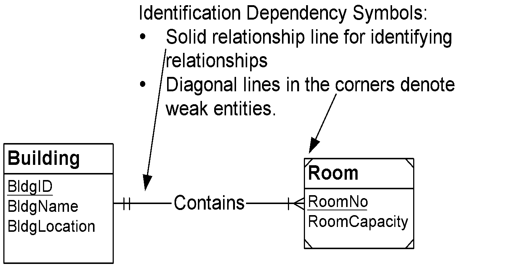
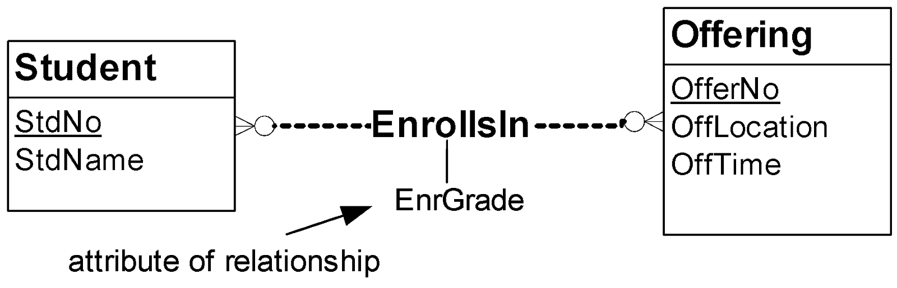
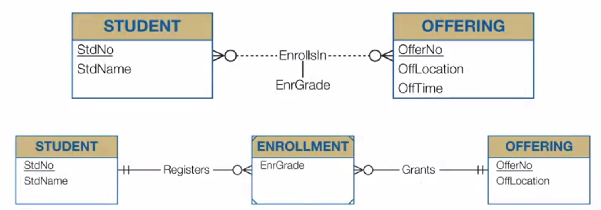
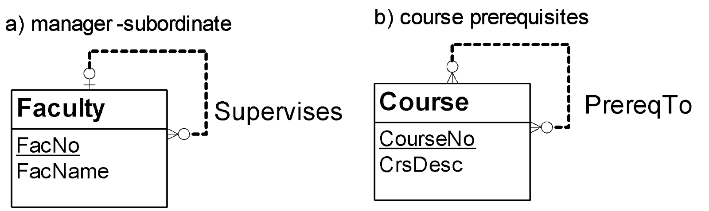
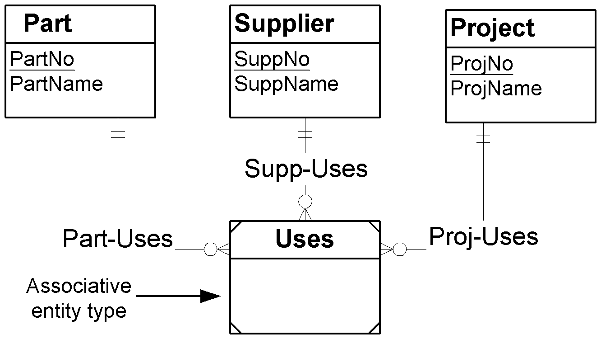

## Week 4 - Notation for Entity Relationship Diagrams

### Database Development Goals

##### Broad Goals of Database Development
- Develop a common vocabulary
- Define business rules
- Ensure data quality
- Provide efficient implementation

##### Database Development Phases
```
- Data Requirements
              - Conceptual Data Modeling
              | ERD
              - Logical Database Design
              | Tables
              - Distributed Database Design
              | Distributed Schema
              - Physical Database Design
                                      - Internal Schema, Populated DB
```


### Basic ERD Notation


##### Basic Elements
- Entity types: collections of physical things, e.g., books, people, payments
- Relationships: named associations among entity types
- Attributes: properties of entity types or relationships

##### Cardinalities
constrain the number of objects that participate in a relationship


##### Important Cardinalities
- Mandatory: Min-card >= 1
- Optional: Min-card = 0
- Functional or Single-valued: Min-card = 1
- 1-M: Max-card = 1 in one direction, Max-card > 1 in the other direction
- M-N: Max-card > 1 in both direction
- 1-1: Max-card = 1 in both direction


### Relationship Variations I

##### Identification Dependency

- Weak entity type: PK가 없는 단위, borrows part or entire primary key, also existent dependent
- Identifying relationship: provides a component of a PK for a weak entity type
- Identification dependency: a weak entity type and one or more identifying relationship
  Specialized existence dependency
- Existent dependent entity types has mandatory participation in a relationship
- Weak entity type: PK가 없는 단위, borrows part or entire primary key, also existent dependent

왜 identification dependency가 일어나느냐? 어떤 개체는 다른 개체에 아주 긴밀하게 관여되는 상황이 있기 때문



ERD의 특징: relationship can have attributes, 특히나 M-N relationship에서 많이 사용하게 됨



##### M-N Relationship Equivalence Rule



- Associative entity type, with two identifying 1-M relationships
- 취향에 맞게 사용하면 되는데, associative entity type이 범용적


### Relationship Variations II

##### Self-Referencing Relationship



- 1-M일 수도, M-N일 수도

##### M-way Relationship



- Association of relationships > 2
- Indirect representation (instead): Associative entity type and a collection of 1-M relationships
- 하지만 M=3 이상인 경우는 현실적으로 거의 없음
