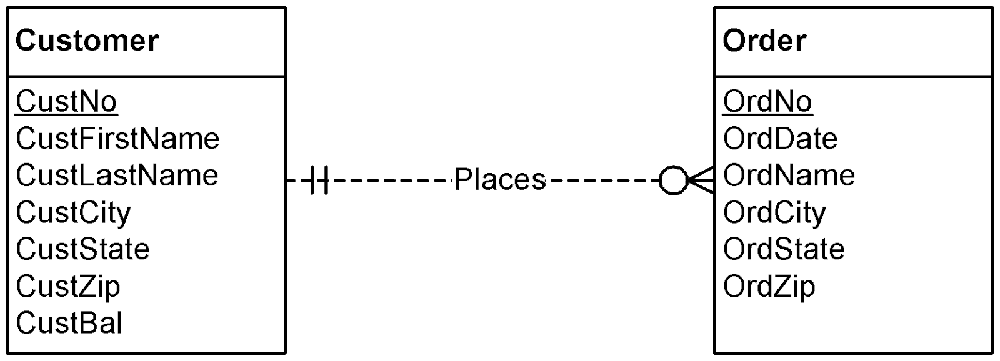

## Week 4 - ERD Rules and Problem Solving

### Basic Diagram Rules

##### Diagram Rules

- Computer 언어의 syntax error와 같은 맥락
- Completeness rules ensure no missing specifications

##### Completeness Rules
- Primary Key Rule: All entity types have a PK (direct or indirect).
- Naming Rule: All entity types, relationships, and attributes have a name.
- Cardinality Rule: Cardinality is specified in both directions for each relationship.
- Entity Participate Rule (optional): All entity types participate in at least one relationship.

##### Issues on PK Rule
- Simple in most cases
- Subtle for some weak entity types
  - e.g., weak entity type with only one 1-M identifying relationship
  - Then, this must have a local key + borrowed PK from the parent entity type
  - Violation of PK Rule if local key is missing

### Extended Diagram Rules

##### Connection Consistency Rules
- Relationship/Entity Connection Rule: Relationships connect two entity types (not necessarily distinct).
- Relationship/Relationship Connection Rule: Relationships are not connected to other relationships.
- Redundant Foreign Key Rule: FKs are not used.

##### Identification Dependency Rules
- Weak Entity Type Rule: Weak entity types have at least one identifying relationship.
- Identifying Relationship Rule: At least one participating entity type must be weak for each identifying relationship.
- Identification Dependency Cardinality Rule:
  The minimum and maximum cardinality must equal 1 for a weak entity type in all identifying relationships.

### ERD Problems I

> `Customer`와 `Order`를 위한 DB Design을 해보시오

> `Order`를 처리하는 `Employee`를 추가해보시오

### ERD Problems 2

위 문제에 이어서 진행됨.

> `Product`를 추가하는데 아래를 만족해야 한다.
> `Order`와 M-N relationship을 가진다.
> 이 relationship은 attribute로 order quantity를 가진다.
> `Order` optional for `Product`
> `Product` mandatory for `Order`

> 위에서 만든 M-N relationship을 2개의 1-M relationship으로 바꿔보시오.

