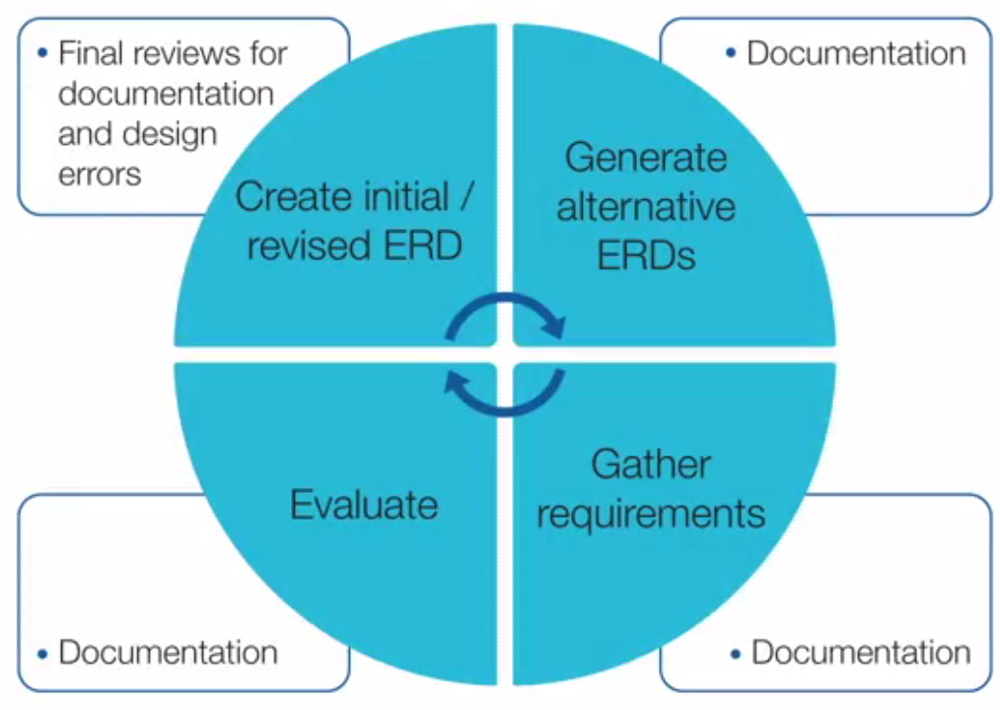

## Week 5 - Data Modeling Problems and Completion of ERD

### Data Modeling Problems I

##### Problem 1. Home and Owner

##### Problem 2. Add Agent

##### Problem 3. Transform Office ID of Agent into a Entity Type

### Data Modeling Problems II

##### Initial Problem: 회사 면접

##### Problem Revision

- Interview blocks
- Bids
- Company positions

### Finalizing an ERD

##### Documenting an ERD

- Important for resolving questions and communicating a design
- Identify inconsistency and incompleteness in a specification
- Identify situations when more than one feasible alternative exists
- Do not repeat the details of the ERD
- Incorporate documentation into the ERD (i.e. 코드의 주석과 같은 개념)

##### Documentation on ER Assistant
##### Documentation on Visual Paradigm

##### Common Design Errors
Syntax error가 diagram error였다면, design error는 semantic error. 따라서 더욱 찾아내기 힘든 반면, 매우 중요한 에러다.

- Misplaced relationships: Wrong entity types connected
- Missing relationships: Entity types should be connected directly
- Incorrect cardinalities: typically using a 1-M instead of M-N
- Overuse of specialized modeling constructs: 어려운 개념 함부로 쓰지 말자.
  - M-way associative entity types
  - Identification dependency
- Redundant relationships: Derived from other relationships
