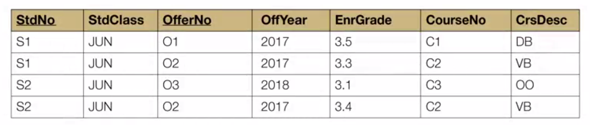
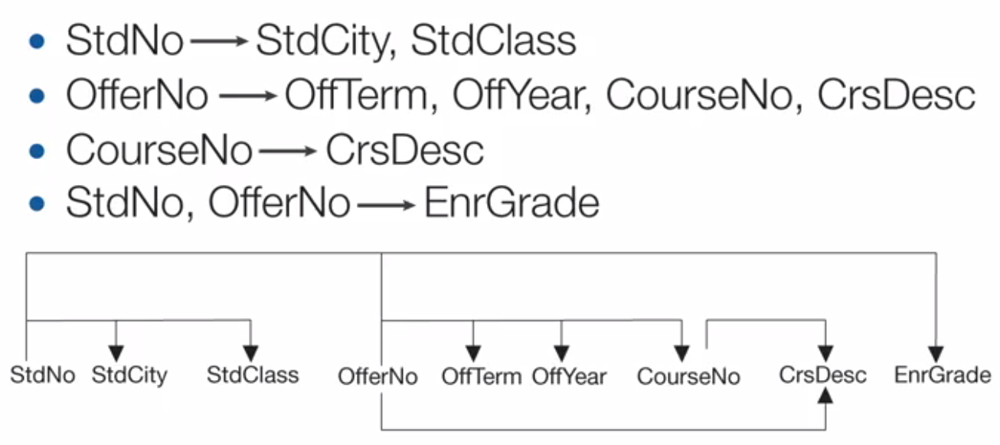
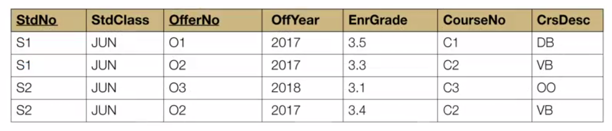
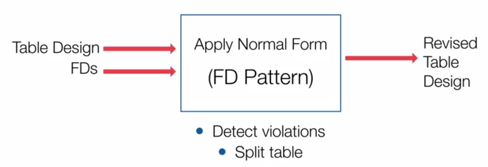
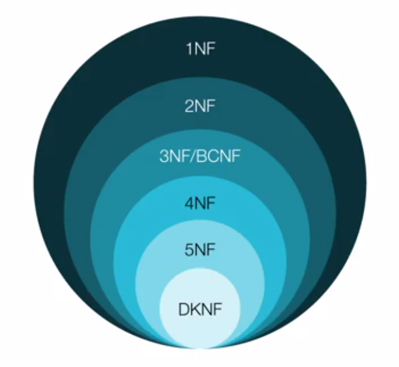
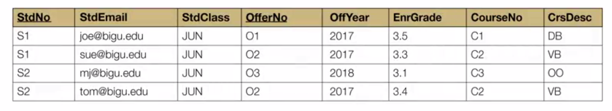
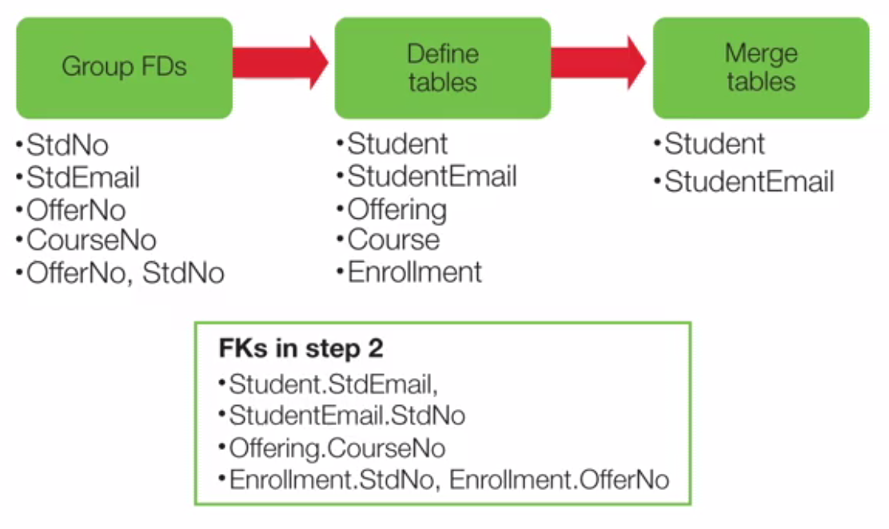
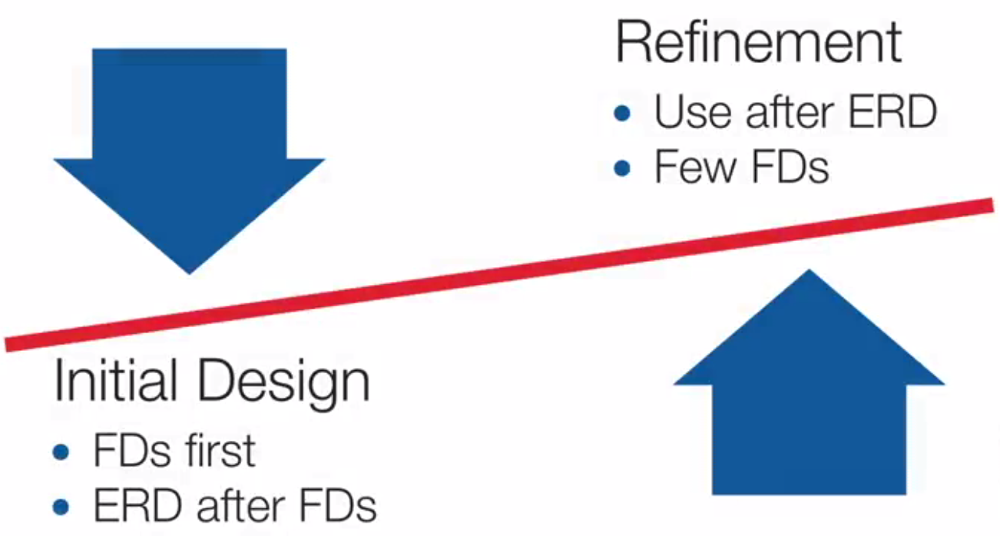

## Week 7 - Normalization Concepts and Practice

### Modification Anomalies
Eliminate unwanted redundancy in a table design

> Good DB design ensures that users can change rows without unexpected side effects.

##### Modification Anomaly
- Unexpected side effects from a row operation
- Insert, modify, and delete more data than desired
- Caused by excessive redundancies

해결하기 위해서
- Strive for "one fact in one place"

##### Big University DB Table: Example of Poorly Designed DB
A single table with a PK as a combination of student number and offer number

- Insertion anomaly: To insert a course (C4), must know student and offering (PK니까)
- Update anomaly: C2 course의 description을 변경하기 위해서는 여러 row를 업데이트헤야 함
- Deletion anomaly: 한 줄에 student, offering, course 정보가 모두 있어서 한 줄을 지우면 다 날라감

##### A Big Table vs. Small Tables
- Query 작성하기엔 big table이 편함 (JOIN small tables == a big table)
- Big table은 modification anomaly 때문에 transaction processing하기가 더욱 어려움

### Functional Dependencies
> The most important part of the normalization process is to identify or assert functional dependencies.

##### Basics
- Constraint on the possible rows in a table
- Value neutral like FKs and PKs
- Constraints must be asserted so that understanding business rules is necessary

##### FD Definition
- X determines Y
  X => Y
- For each X value, there is at most one Y value
  e.g., StdNo => StdCity

##### Unique Constraints Analogy
- Similar to unique constraint
  If X => Y, columns X and Y in the same table without other columns,
  then X should have unique values.

##### Falsification

> A FD cannot be proven to be exist by examining the rows of a table.
> However, you can falsify a functional dependency by examining sample rows of a table.

> Find two rows that have the same X values but a different Y value!

- StdNo -X-> OfferNo by (#1, #2), (#3, #4)
- StdNo -X-> EnrGrade by (#3, #4)
- StdNo -?-> StdClass

### Normal Forms

- Input to Normalization
  - A list of FDs in a table design
  - Including a designation of unique columns
- Applying a Normal Form
  - Detect violations of the allowable pattern of FD
  - split the original table into smaller if a violation is found
- Revised Table Design
  - should conform to the allowable FD pattern specified by the normal form

> A normal form is a rule about allowable FDs.

##### Relationships of Normal Forms

- First normal form is the starting point.
- Second normal form is stronger than the first one.
  Only a subset of first normal form tables are in the secord one.
- Each successive normal form refines the previous one to remove additional kinds of redundancies.
- BCNF (Boyce-Codd Normal Form) is revised and stronger definition for the third one.
- BCNF is the most important because higher normal forms involve other kinds of constraints that are less common and more difficult to understand.
  즉 BCNF가 가장 중요한 constraints를 담당한다는 것.

##### Boyce-Codd Normal Form
- Originally conceived as a simpler definition of the third normal form.
- BCNF requires that every determinant must be unique in a table.
  A FD violates BCNF if the determinate in the FD is not unique in a table.
- After demonstrating violations of BCNF, a simple procedure will be presented to refine a table design so that it conforms to BCNF. 

##### Exercise with Big University Table

- PKs: StdNo + OfferNo
- Unique columns: (StdNo, OfferNo), (StdEmail, OfferNo)
- BCNF violations: LHS of FD is not a determinant.
  - StdNo => StdCity, StdClass, StdEmail
    StdNo is a subset of a determinant (StdNo, OfferNo), but not a determinant itself.
  - StdEmail => StdNo
  - OfferNo => OffTerm, OffYear, CourseNo
  - CourseNo => CrsDesc

##### BCNF Procedure

1. Organize FDs by determinant: Group FDs by the same determinant
2. Define tables
  - One for each FD group
  - Determinant = PK
  - Also add FKs
3. Merge tables to prevent excessive splitting
  - If one table contains a subset of columns in the other table

### Practical Concerns

##### Competing Roles of Normalization: Refinement Tool vs. Initial Design Tool

교수님은 refinement tool로써 normalization을 사용하는 것이 비교적 적절하다고 이야기 함.
ERD를 그리는 것만으로도 (FD를 기록하는 지겨운 일 없이) 많은 normalization이 달성되기 때문.

##### Denormalization
- Purposeful violation of a normal form
- Some FDs may not cause anomalies in practice (명확한 business rule에 의해)
- May improve performance (많은 join을 하지 않아도 되니까)
- Common for DW (무거운 query가 많아서)
